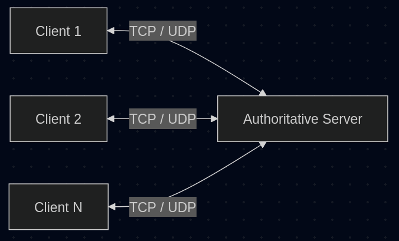
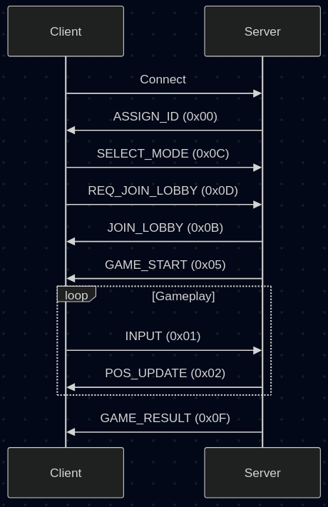
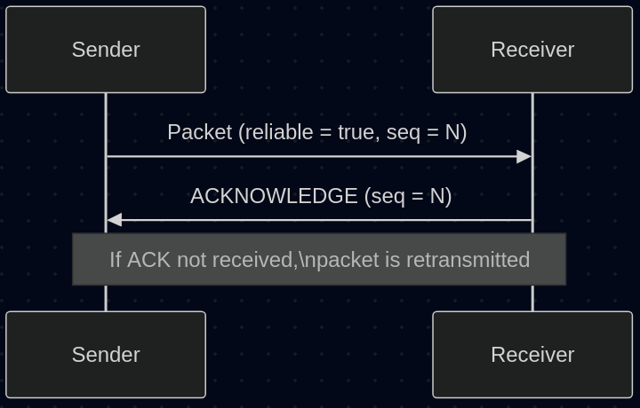
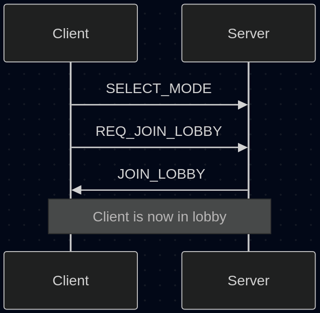
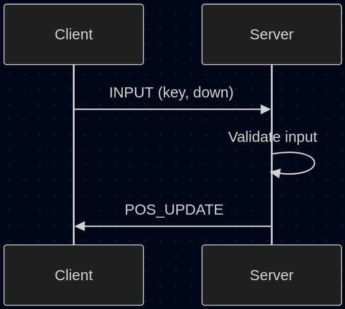
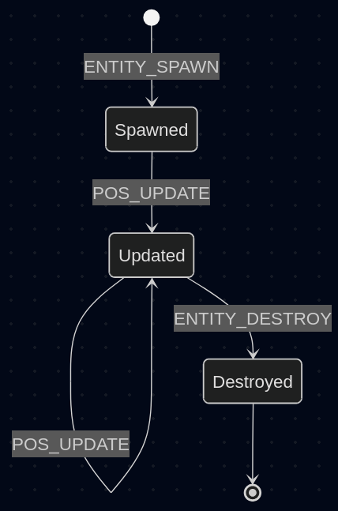
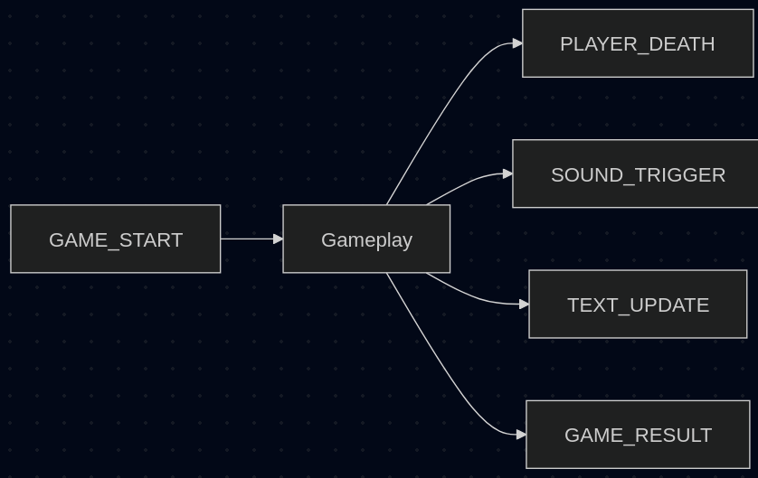

# R-Type Game Protocol — Illustrated Guide

This document provides a visual and structured explanation of the **R-Type Game Protocol**.
It complements the original specification by adding diagrams and visual aids to simplify
understanding of packet flow, structures, and gameplay interactions.

---

## 1. High-Level Architecture



The protocol is designed around a **client–server architecture**:
- One authoritative server
- Multiple connected clients
- Real-time communication using **TCP and UDP**
- Binary packets for performance

---

## 2. Communication Lifecycle



The communication is divided into three main phases:

1. **Connection**
   - Client connects
   - Server assigns a unique Player ID
2. **Lobby**
   - Mode selection
   - Lobby creation or join
3. **Gameplay**
   - Real-time input
   - Entity synchronization
   - Game result

---

## 3. Data Representation

All numeric values are transmitted using **Big Endian (Network Byte Order)**.

| Type     | Size |
|----------|------|
| uint8    | 1 B  |
| uint16   | 2 B  |
| uint32   | 4 B  |
| uint64   | 8 B  |
| float32 | 4 B  |

No structure padding is used.

---

## 4. Packet Structure


Each packet is composed of:

```
+------------+-------------------+-------------+
| Opcode (1) | Sequence Nbr (4)  | Reliable(1) |
+------------+-------------------+-------------+
|           Payload (Variable Length)          |
+----------------------------------------------+
```

- **Opcode**: Identifies the command
- **Sequence Number**: Used for reliability
- **Reliable flag**: Indicates if ACK is required

---

## 5. Reliability Layer



Some packets require reliability:
1. Sender transmits packet with `reliable = true`
2. Receiver replies with `ACKNOWLEDGE`
3. Missing ACK triggers retransmission

---

## 6. Lobby Management Flow



Typical lobby sequence:
1. Client selects game mode
2. Client requests lobby join
3. Server confirms lobby entry
4. Players wait for game start

---

## 7. Gameplay Input Flow



- Client sends **INPUT** packets
- Server validates and applies logic
- Server broadcasts updated state

This ensures:
- Anti-cheat protection
- Server authority

---

## 8. Entity Synchronization



The server:
- Spawns entities
- Updates positions in batches
- Destroys entities when needed

POS_UPDATE uses **parallel arrays** to reduce packet overhead.

---

## 9. Game State Events



Special packets:
- GAME_START
- PLAYER_DEATH
- GAME_RESULT
- SOUND_TRIGGER
- TEXT_UPDATE

Used for synchronization of non-physical game events.

## 10. Summary

The R-Type protocol is:
- Binary
- Efficient
- Server-authoritative
- Designed for real-time multiplayer gameplay

This illustrated guide should be used alongside the formal specification.
