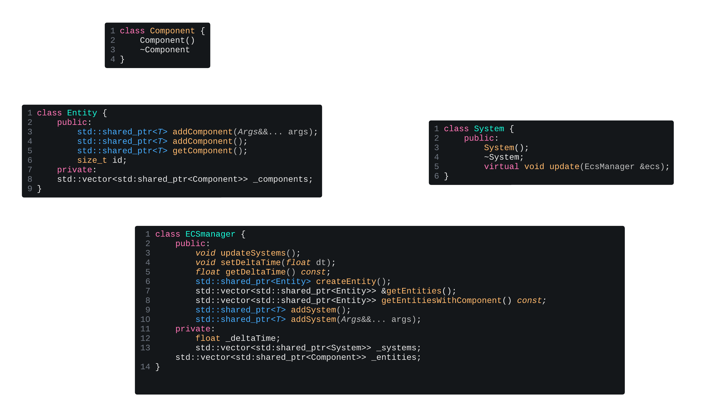

# HOW TO CONTRIBUTE - R-TYPE

> Group - Save Gougougagaland - Epitech Lille - 2025
---
## ECS 

### Introduction 
We use an Entity Component System because it keeps the engine modular, efficient, and easy to extend. Components store data, systems handle logic, and entities simply combine them — which lets us reuse behaviors, avoid code duplication, and manage large numbers of objects smoothly. For a fast-paced game like R-Type, this architecture makes it easier to add features, improve performance, and keep the codebase clean.

It is composed as follows:



We have an EcsManager that contains our systems and entities, and each entity is itself composed of components. In the game loop, we call every system added to the ECS. An entity can be the player, enemies, the background, etc.

Here is the link to the diagram [link](https://lucid.app/lucidchart/d7494efd-aa0c-409f-a5d8-0528223e1618/edit?page=HWEp-vi-RSFO#)

List of components already implemented:
1. Animation
2. Collsion
3. Destroy
4. Enemy
5. Health
6. InputPlayer
7. Position
8. Shoot
9. Sound
10. Srpite
11. Velocity
12. PlayerAnimation 

List of systems already implemented:
1. CollsionSystem
2. DestroySystem
3. InputSystem
4. MovementSystem
5. PlayerAnimationSystem
6. RenderSystem
7. ShootSystem
8. SpriteAnimationSystem
9. VelocitySystem

### Add a component 

You need to:
1. Create a class in ecs/src/component.
2. Put it in the ecs namespace.
3. Make it inherit from Component.
4. Add any parameters and methods you need.
5. Add it to your entity.

Example : 
```
    entity->addComponent<ecs::Health>(100);
```

### Add a system

Il faut : 

1. Creer une classe dans ecs/src/system. 
2. Mettre dans le namespace ecs 
3. La faire hérité de system
4. Ajouter les parametres souhaité 
5. Implémenter obligatoirement la fonction update 
6. L'ajouter a l'EcsManager 

Example : 
```
    _ecs.addSystem<ecs::CollisionSystem>();
```

### Init Ecs

Voici un exemple simple de comment init un ecs 

```
    sf::RenderWindow window(sf::VideoMode({WINDOW_X, WINDOW_Y}), "R-Type");
    auto entity = _ecs.createEntity(); 
    entity->addComponent<ecs::Health>(100);
    _ecs.addSystem<ecs::CollisionSystem>();

    while (window.isOpen()) {
    float const deltaTime = clock.restart().asSeconds();

        while (const std::optional event = window.pollEvent()) {
            if (event->is<sf::Event::Closed>()) {
                window.close();
            }
        }
        _ecs.setDeltaTime(deltaTime);
        _ecs.updateSystems();
    }
```


## Server

## Client 

## Tests

## Author
Aleksandra Racine 
